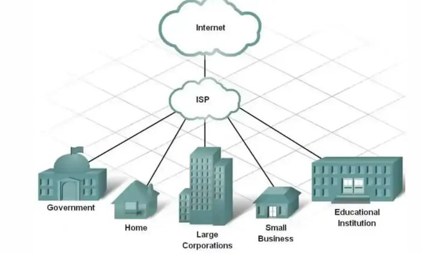

-------------------------------- How the Web Works? ---------------------------------------------------------
A client is the entity requesting information, while a server is the entity providing it. Essentially, the client asks for something, and the server serves it. 
This is the basic definition of client-server architecture.

# IP Address
Each system on the internet has an IP address.
An IP address is like a home address for devices on the internet. It uniquely identifies devices (like computers or phones) so they can find and communicate with each other.

Examples:
IPv4: 192.168.1.1
IPv6: `2001:0db8:85a3...

# Domain Name
A domain is a human-readable address linked to a unique IP address.

# Domain Name Parts
When you say https://www.google.com, there are specific parts, each with its own significance:

- Root Level Domain:
The last dot represents the root level domain.

- Top-Level Domain (TLD):
Examples: .edu, .org, .gov, .com, .au.

- Second-Level Domain:
Examples:
openoffice.org
expedia.gov
microsoft.com
congress.au

- Third-Level Domain:
Examples:
[www.example.com](http://www.example.com)
download.microsoft.com
sales.microsoft.com

# Data Centers
A data center is a physical facility that stores computing equipment and digital data for companies. It's like a server, but without displays—only CPUs and hardware managing incoming requests.

Where are data centers located?
Data centers can exist in multiple physical locations worldwide, all interconnected through optical fibers. These fibers connect across oceans and land, forming a global network.
There are other ways as well like LAN, satellite etc but these are not very reliable because of geographical issues, weather conditions etc.

Similarly, everything is interconnected, and we get internet connectivity. Data centers provide the data we request via the internet through our browsers. In India, we use internet providers like Jio, VI, and Airtel. These are ISPs (Internet Service Providers). When you relocate to a new city, you may get broadband services like "ABC Internet Broadband" offering speeds like 100 Mbps. These are also ISPs. Let’s explore more about ISPs and how they work.

# ISP (Internet Service Provider)

An ISP (Internet Service Provider) is a company that provides internet access to individuals and businesses.
ISPs connect users to the internet backbone, assign IP addresses, and route data requests to the correct servers. They manage the local infrastructure and provide bandwidth for internet use.

# -------------------------- What Happens When You Hit a URL -------------------------------------------------

# Surface level understanding - Whenever you type google.com, the request goes through the router to the ISP via the internet. Then it hits a DNS server, which provides the IP of the domain. Using that IP, the server is contacted, and it responds with HTML, CSS, and JS files.

## IN DEPTH - 

When you type a URL, it doesn’t directly go to the router. First, the browser performs some internal operations:
1. Browser Level Processing: 

A. Browser DNS Cache: Chrome/Firefox/Safari keep their own internal list of recently visited domains and their IP addresses. The browser first looks in its own cache (disk and memory) for the resource. If found and fresh (based on headers like Cache-Control), it serves it instantly—no network needed. This skips everything else.

B. Service Worker Cache: If a site has registered a service worker (a JavaScript script running in the background), it intercepts the request. Service workers enable advanced caching strategies (e.g., "stale-while-revalidate" from your example site), offline support, and faster responses by serving cached data while fetching updates. In DevTools > Network tab, you'll see (ServiceWorker) next to timings, and status like 200 (from cache) or 304 (not modified).

C. OS Cache (The "Hosts" file & Resolver Cache): The asks the Operating System. The OS checks:
    - The hosts file: A manual override file on your computer.
    - The DNS Resolver Cache: A temporary database of recent DNS lookups managed by the OS (e.g., ipconfig /displaydns on Windows).

D. Router Cache: If the OS doesn't know, the request hits your router, which often has its own small DNS cache.

2. Local Network (Router and ISP Routing): 
What we currently know is that ISPs deal with the internet, but that’s not entirely true.

When you request data via an IP, it often passes through multiple layers of ISPs:
- Local ISPs
- Regional ISPs
- Global ISPs
Then, it reaches the server in the respective country.

However, this is not always the case. Big companies like Netflix and Google optimize their systems by deploying data centers in multiple countries. This minimizes cross-region requests and ensures faster access to data. For example, Netflix stores data at the regional ISP level, so users experience minimal latency.
Tools like whois.com show domain ownership; nslookup or DevTools > Network reveals IPs.

3. Establishing Connection to Server:
A. DNS Lookup: 
This step resolves the domain name to the correct IP address. 

B. TCP Three-Way Handshake (The "Meeting"): 
Before sending data, the browser and server must agree they are ready.
SYN: Browser sends a "Synchronize" packet.
SYN-ACK: Server responds with "Synchronize-Acknowledge."
ACK: Browser sends an "Acknowledge."

C. TLS/SSL Handshake (The "Secret Language"):
If the site is HTTPS, a second handshake occurs to encrypt the connection.
The browser verifies the server’s SSL Certificate (checking its digital "ID card").
They exchange keys so that all future data sent is unreadable to anyone else (like your ISP or a hacker).

D. The HTTP Request & Response:
Now that the "pipe" is open and secure, the browser finally asks for the content.
Request: GET /index.html HTTP/1.1
Response: The server sends back a status code (like 200 OK) and the raw code of the website (HTML).

# -------------------------- How the Browser Processes a Web -------------------------------------------------
When the server finally hands over the HTML, the browser kicks into high gear. It follows a strictly ordered sequence called the Critical Rendering Path (CRP).

1. Loading & Parsing (The "Blueprint" Phase):
The browser doesn't wait for the whole file; it starts processing as soon as the first "chunks" of data arrive.

A. DOM Construction: The browser reads HTML and turns it into the Document Object Model (DOM).

B. The "Preload Scanner": While the main parser is building the DOM, a separate "scanner" peeks ahead to find external assets like CSS, JS, and images so it can start downloading them in the background.

C. CSSOM Construction: When it hits a <link rel="stylesheet">, it fetches the CSS and builds the CSS Object Model (CSSOM).

## The Render-Blocking Rule: The browser cannot display anything until both the DOM and CSSOM are ready. It refuses to show a page without styles to avoid a "Flash of Unstyled Content" (FOUC).

## Important rules
- CSS files are requested immediately.
- JS files are requested based on attributes - 
    1. Normal <script> → blocks parsing
    2. defer → downloaded in parallel, executed after HTML parsing
    3. async → downloaded + executed immediately when ready

2. Scripting (The "Interruption"): 
JavaScript is the most "expensive" part of the process because it is Parser Blocking.

Wait & Execute: When the browser hits a <script> tag, it stops building the DOM. It must download and run the script first because the script might change the HTML (e.g., document.write).

Dependency: JS also waits for CSS. If a script asks for an element's color, the browser must finish building the CSSOM first to give an accurate answer. (Why CSS is render-blocking? For the same mentioned reason)

#Why JS is parser-blocking?
JS can modify DOM and CSSOM. Browser pauses HTML parsing when it hits a normal <script>.

Execution flow: 
Stop HTML parsing -> Download JS (if not cached) -> Execute JS -> Resume HTML parsing (defer and async change this behavior)

3. Rendering (The "Construction" Phase):
Now that the browser has the structure (DOM) and the styles (CSSOM), it combines them (merge both the trees).

The Render Tree: It creates a tree of only the visible elements.
## Elements with display: none are left out of this tree entirely. 

Layout (Reflow): The browser calculates the geometry. It determines exactly where every box sits on the screen and how large it is, based on the viewport size (e.g., mobile vs. desktop).

#How browser handle visibility: hidden (Differently from display:none)

- The Render Tree (The Key Difference)

Unlike display: none, which removes the element from the tree entirely, an element with visibility: hidden stays in the Render Tree.

The browser knows the element exists. It keeps all the computed styles (font, padding, margins). It treats it as a node that has a visual presence, even if it has no "link."

- Layout (The "Empty Space" Stage)
This is where the biggest visual difference happens. Because the element is still in the Render Tree, the browser must calculate its geometry.

Space is preserved: The browser calculates the width, height, and position of the element.
Document Flow: Other elements are pushed aside or down to make room for it, just as if it were visible.
Result: You get a blank gap on the webpage where the element used to be.

- Painting & Compositing
This is the stage the browser actually "skips" to save work.
No Pixels: The browser does not draw any colors, text, or borders for the hidden element.
Interactivity: Unlike opacity: 0 (where you can still click a button), visibility: hidden makes the element non-interactive. The browser ignores clicks, hovers, and focus events on that "empty space."
Accessibility: Most modern browsers will also remove the element from the Accessibility Tree, meaning screen readers will skip over it.

4. Painting & Compositing (The "Visual" Phase): 
This is where the math turns into actual pixels.

Painting: The browser creates a "draw list" (e.g., draw background here, then text there). For efficiency, it often paints different elements onto separate Layers.

Rasterization: These layers are turned into bitmaps (grids of pixels).

Composition: Finally, the Compositor Thread sends these layers to your GPU (Graphics Processing Unit). The GPU stacks them together in the right order (respecting z-index) and puts the final image on your screen.